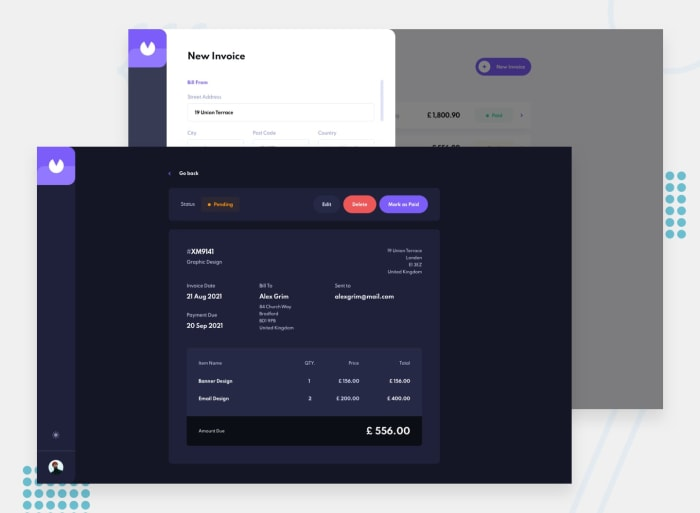

# Invoice App

A modern, responsive invoice management application built with Preact that allows users to create, manage, and track invoices with full CRUD functionality.

## 🖼️ Preview



## 🚀 Live Demo

Check out the live version: [Invoice App](https://sarfaraz.is-a.dev/frontendmentor/invoice-app-main/)

## ✨ Features

- **Create, Read, Update, Delete (CRUD) Operations**: Full invoice management capabilities
- **Dark/Light Theme**: User preference-based theme switching with persistent settings
- **Form Validation**: Comprehensive client-side validation for all input fields
- **Invoice Status Management**: Track invoices as paid, pending, or draft
- **Local Storage**: Persistent data storage across browser sessions
- **Responsive Design**: Fully responsive layout for all device sizes
- **Modern UI/UX**: Clean, intuitive interface with smooth transitions
- **Filtering**: Filter invoices by status (paid, pending, draft)
- **Itemized Lists**: Add multiple items with quantities and prices to each invoice

## 🛠️ Technologies Used

- **HTML5**: Semantic markup and structure
- **Preact**: Lightweight React alternative for component-based architecture
- **HTM (Hyperscript Tagged Markup)**: JSX alternative using JavaScript template literals
- **Tailwind CSS**: Utility-first CSS framework for styling
- **JavaScript ES6+**: Modern JavaScript features and functionality
- **Local Storage API**: Client-side data persistence

## 📋 Functionality

### Main Views

- **Dashboard**: Overview of all invoices with filtering capabilities
- **Invoice List**: Filterable list of all invoices with status indicators
- **Invoice Detail**: Detailed view of individual invoices
- **Invoice Form**: Create and edit invoices with validation

### Key Features

- **Create New Invoices**: Full-featured form for creating new invoices
- **Edit Existing Invoices**: Modify any existing invoice details
- **Status Tracking**: Visual indicators for paid, pending, and draft invoices
- **Delete Confirmation**: Safe deletion with confirmation dialog
- **Mark as Paid**: Update invoice status with a single click
- **Filter by Status**: Filter invoices by their current status
- **Responsive Layout**: Works seamlessly on desktop, tablet, and mobile

### Data Management

- **Persistent Storage**: All invoices saved to local storage
- **Data Validation**: Client-side validation before saving
- **Form Handling**: Dynamic forms with proper state management
- **Unique IDs**: Auto-generated invoice IDs for tracking

## 🎨 Design & UI

- **Modern UI**: Clean, professional design following current UI/UX trends
- **Theme Support**: Dark and light mode with smooth transitions
- **Visual Hierarchy**: Clear information architecture and visual flow
- **Status Indicators**: Color-coded status badges for quick recognition
- **Interactive Elements**: Hover effects and smooth transitions
- **Responsive Components**: Flexible layouts for all screen sizes

## 📱 Responsive Design

- **Mobile-First Approach**: Optimized for mobile devices first
- **Breakpoint Strategy**: Well-optimized layouts for mobile, tablet, and desktop
- **Touch-Friendly**: Appropriate touch targets and interactions
- **Flexible Grids**: Dynamic grid layouts that adapt to screen size

## 🏗️ Project Structure

```text
invoice-app-main/
├── assets/                 # Images, icons, and other assets
│   ├── icon-arrow-down.svg
│   ├── icon-arrow-left.svg
│   ├── icon-check.svg
│   ├── icon-delete.svg
│   ├── icon-moon.svg
│   ├── icon-plus.svg
│   ├── icon-sun.svg
│   ├── illustration-empty.svg
│   ├── image-avatar.jpg
│   └── logo.svg
├── components/            # Reusable Preact components
│   ├── Button.js
│   ├── InvoiceDetail.js
│   ├── InvoiceForm.js
│   ├── InvoiceList.js
│   └── Sidebar.js
├── styles/                # CSS files
│   └── style.css
├── app.js                 # Main application component
├── components/            # Component files
├── index.html             # Main HTML file
├── input.css              # Tailwind CSS input file
├── tailwind.config.js     # Tailwind CSS configuration
├── utils.js               # Utility functions
└── README.md              # This file
```

## 🚀 How to Use

### Creating an Invoice

1. Click the "New Invoice" button
2. Fill in the sender and client information
3. Add items with descriptions, quantities, and prices
4. Set the invoice date and payment terms
5. Save as draft or send immediately

### Managing Invoices

1. View the dashboard to see all invoices
2. Click on any invoice to view details
3. Use the action buttons to edit, delete, or mark as paid
4. Filter by status to focus on specific invoices

### Theme Switching

- Toggle between dark and light mode using the moon/sun icon
- Theme preference persists across sessions

## 🎯 Target Users

- Small business owners
- Freelancers
- Accountants
- Anyone needing to create and manage invoices
- Users who prefer lightweight, fast web applications

## 📊 User Experience

- **Intuitive Interface**: Clean layout with logical information flow
- **Quick Actions**: Common actions available with minimal clicks
- **Visual Feedback**: Clear status indicators and loading states
- **Error Prevention**: Validation and confirmation dialogs prevent mistakes
- **Accessibility**: Proper ARIA labels and keyboard navigation support

## 🧪 Browser Support

- Chrome (latest)
- Firefox (latest)
- Safari (latest)
- Edge (latest)

## 🤝 Contributing

While this is a personal project, I welcome feedback and suggestions. If you notice any issues or have ideas for improvements, please feel free to open an issue.

## 📄 License

This project is part of my Frontend Mentor portfolio. The code is provided for showcase purposes to demonstrate my skills as a frontend developer.

## 🌐 About Frontend Mentor

This project was completed as part of the [Frontend Mentor](https://www.frontendmentor.io) challenge series. Frontend Mentor provides real-world design challenges to help developers improve their skills.

---

### *Created with ❤️ by sarfarazstark*
